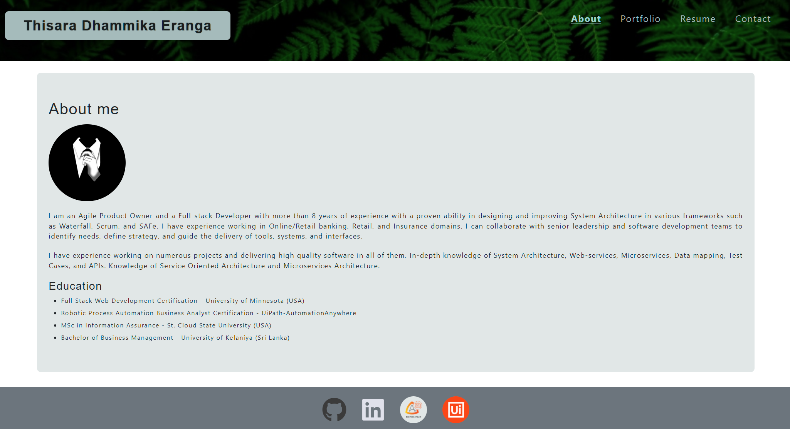

# 🎨 Portfolio-TDE

> A modern professional portfolio showcasing my projects and work

## ✨ Overview

Welcome to my professional portfolio website! Here you'll find a curated selection of my best projects, each with links to the source code and live demos. Feel free to explore and get in touch if you have any questions.

[**Visit the Live Portfolio**](https://thisara-de.github.io/portfolio/) →

---

## 🛠 Tech Stack

<div align="center">

| Technology | Purpose |
|-----------|---------|
| **React.js** | UI Framework |
| **Bootstrap** | Responsive Design |
| **JavaScript** | Logic & Interactivity |
| **Node.js** | Runtime Environment |
| **CSS** | Styling & Animations |

</div>

---

## 📊 Language Composition

```
JavaScript  ████████████████████████░░░░░░░░░ 48.5%
CSS         ███████████████████░░░░░░░░░░░░░░ 40.5%
HTML        █████░░░░░░░░░░░░░░░░░░░░░░░░░░░ 11.0%
```

---

## 🚀 Quick Start

### Installation

```bash
# Clone the repository
git clone https://github.com/Thisara-DE/portfolio.git
cd portfolio

# Install dependencies
npm install
```

### Usage

```bash
# Start development server
npm start

# Run tests
npm test

# Build for production
npm run build
```

---

## 📸 Preview



---

## 📁 Project Structure

```
portfolio/
├── src/
│   ├── assets/           # Images and static files
│   ├── components/       # React components
│   ├── pages/           # Page components
│   └── App.js           # Main app component
├── public/              # Static public files
├── package.json         # Project dependencies
└── README.md           # This file
```

---

## 🎯 Features

- ✅ Responsive design that works on all devices
- ✅ Modern UI with smooth animations
- ✅ Project showcase with GitHub links
- ✅ Fast and optimized performance
- ✅ Easy to customize and extend

---

## 📝 License

© 2022 [Thisara-DE](https://github.com/Thisara-DE). All rights reserved.

---

## 💬 Get In Touch

Have questions or want to collaborate? Feel free to reach out!

📧 **Email**: [thisaraeranga@gmail.com](mailto:thisaraeranga@gmail.com)  
🔗 **GitHub**: [@Thisara-DE](https://github.com/Thisara-DE)

---

<div align="center">

**Made with ❤️ by Thisara**

</div>
